## Ported Themes

### aalto-dark

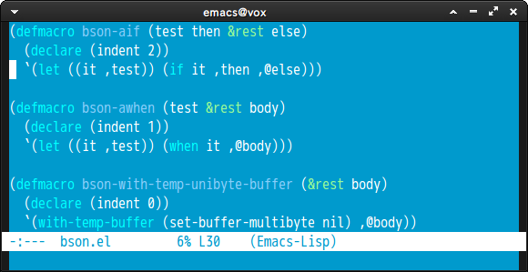

### aalto-light

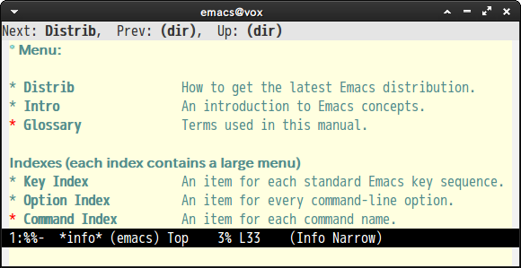

### aliceblue

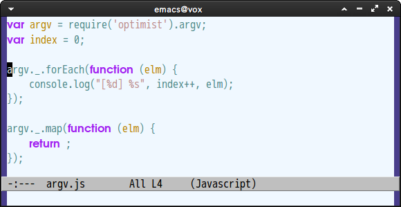

### andreas

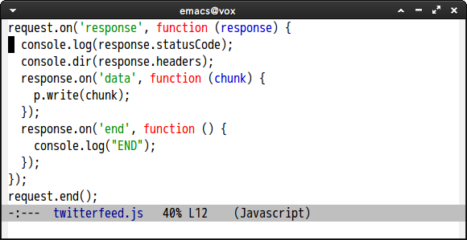

### arjen

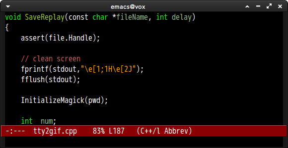

### beige-diff

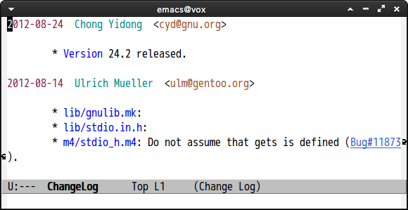

### beige-eshell

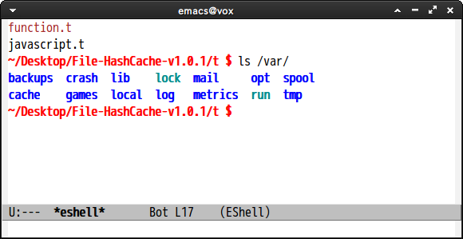

### bharadwaj-slate

### bharadwaj

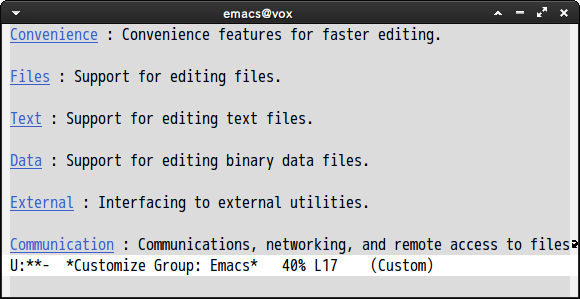

### billw

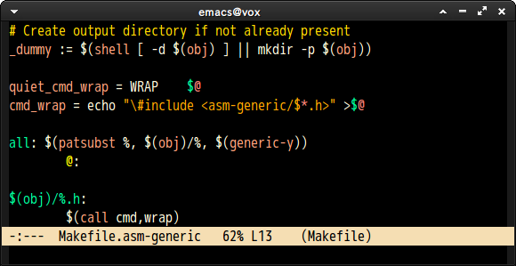

### black-on-gray

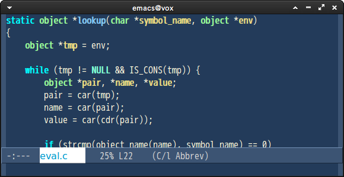

### blippblopp

### blue-erc

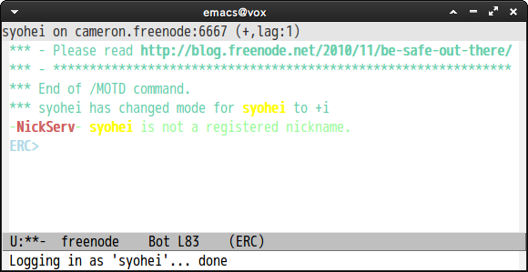

### blue-eshell

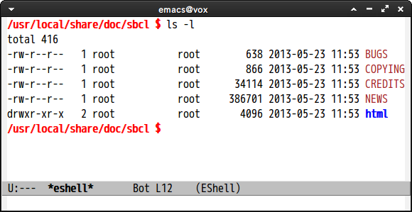

### blue-gnus

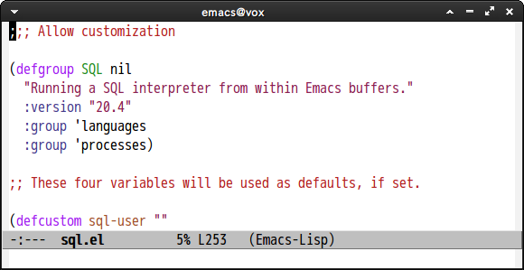

### blue-mood

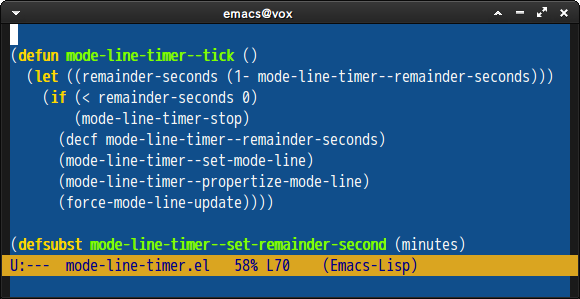

### blue-sea

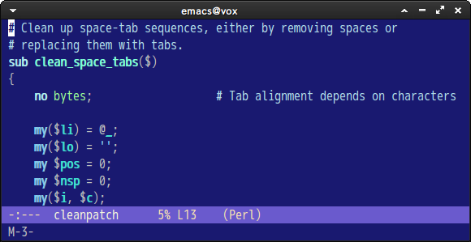

### calm-forest

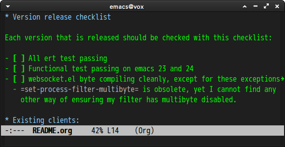

### charcoal-black

### clarity

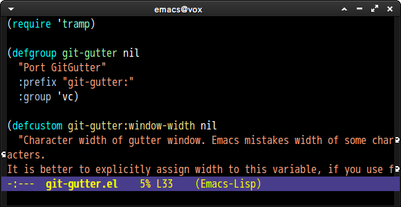

### classic

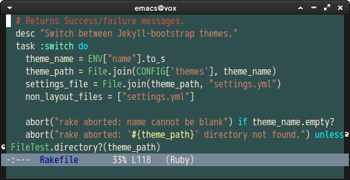

### cobalt

### comidia

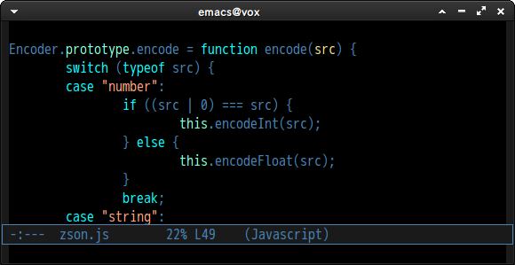

### dark-blue

### dark-blue2

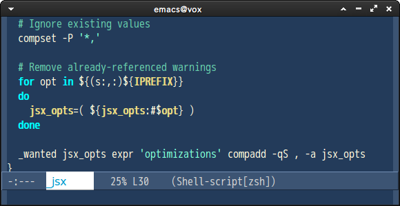

### dark-erc

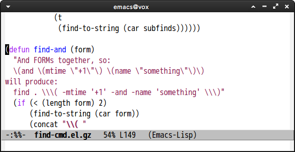

### dark-font-lock

### dark-gnus

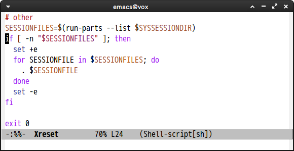

### dark-green

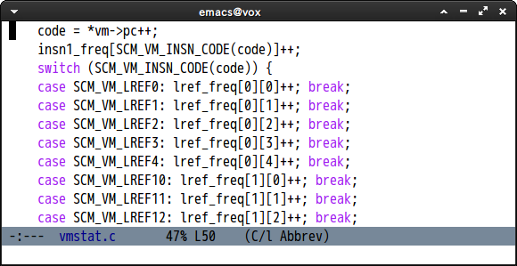

### dark-info

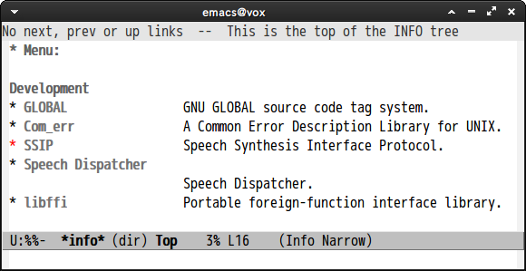

### dark-laptop

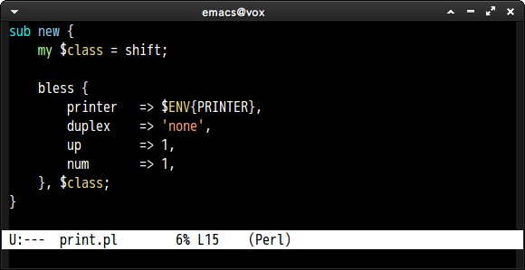

### deep-blue

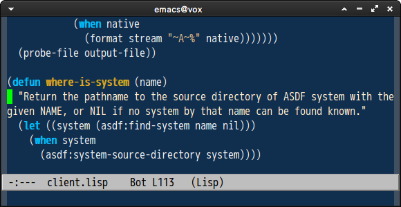

### desert

### digital-ofs1

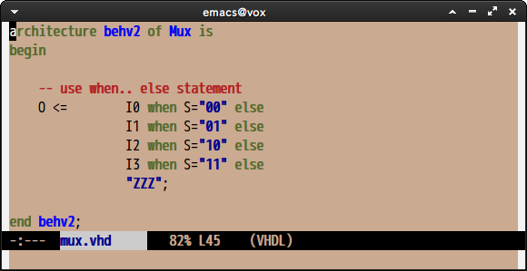

### emacs-21

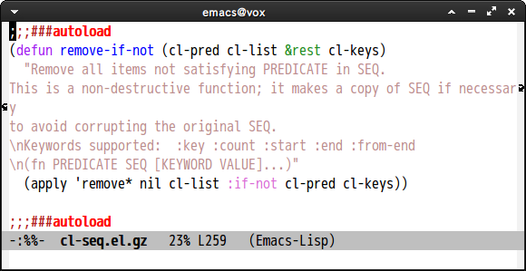

### emacs-nw

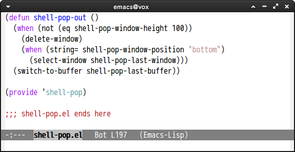

### euphoria

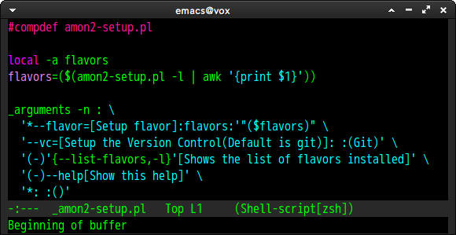

### feng-shui

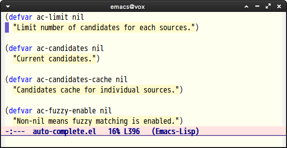

### fischmeister

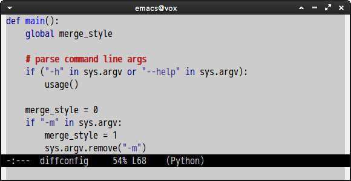

### gnome

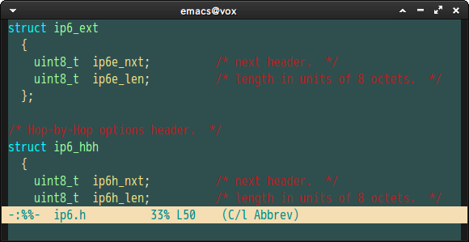

### gnome2

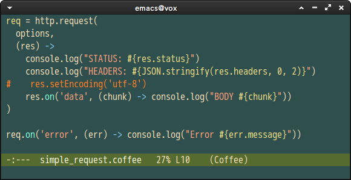

### goldenrod

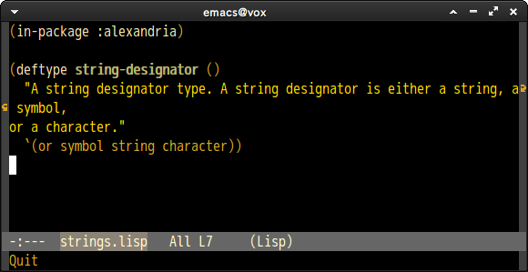

### gray1

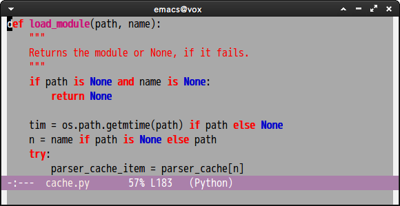

### gray30

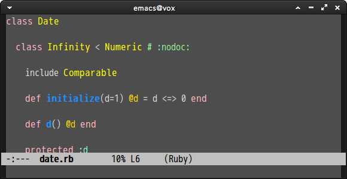

### greiner

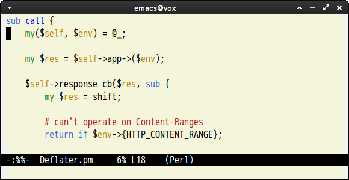

### gtk-ide

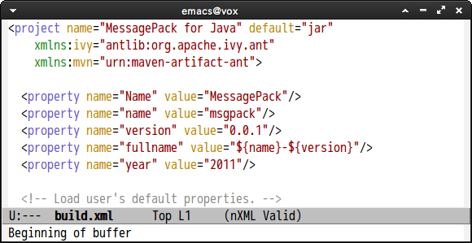

### high-contrast

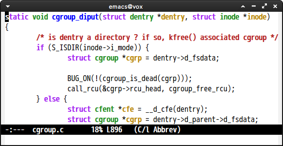

### hober

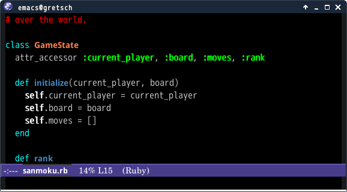

### infodoc

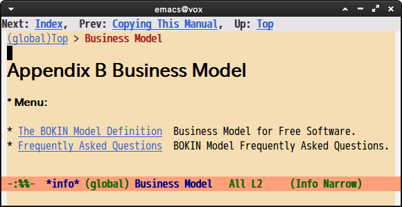

### jb-simple

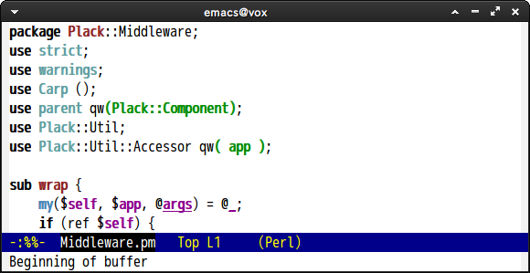

### jedit-grey

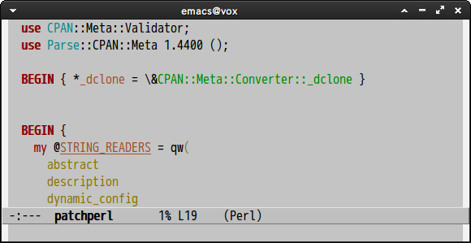

### jonadabian-slate

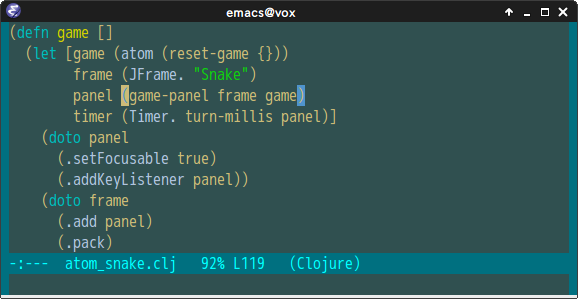

### jonadabian

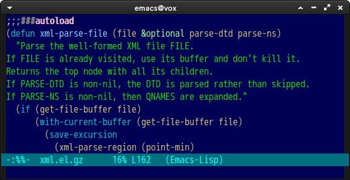

### jsc-dark

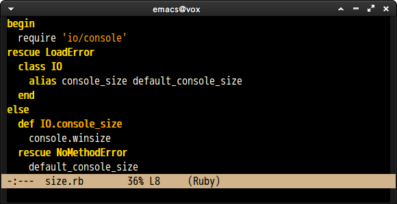

### jsc-light

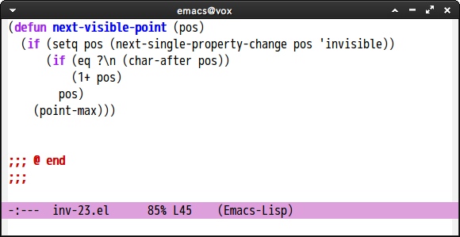

### jsc-light2

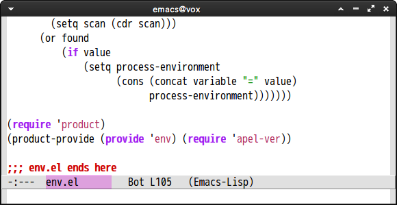

### katester

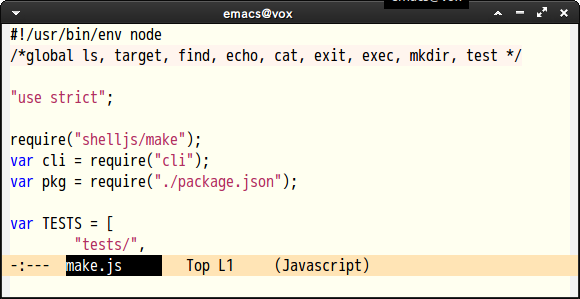

### kingsajz

### late-night

### lawrence

### ld-dark

### lethe

### marine

### marquardt

### matrix

### midnight

### mistyday

### montz

### oswald

### parus

### pierson

### pok-wob

### pok-wog

### ramangalahy

### raspopovic

### renegade

### resolve

### retro-green

### retro-orange

### robin-hood

### rotor

### ryerson

### salmon-diff

### salmon-font-lock

### scintilla

### shaman

### simple-1

### sitaramv-nt

### sitaramv-solaris

### snow

### snowish

### standard-ediff

### standard

### subtle-blue

### subtle-hacker

### taming-mr-arneson

### taylor

### tty-dark

### vim-colors

### whateveryouwant

### wheat

### word-perfect

### xemacs

### xp

## 3rd Party Theme

### julie

### subdued

